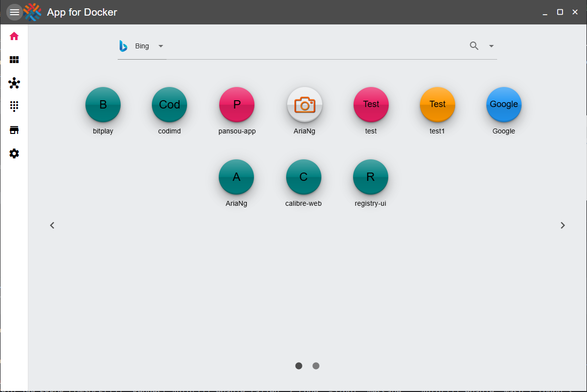
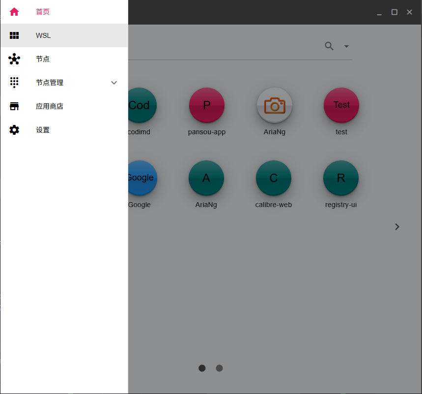
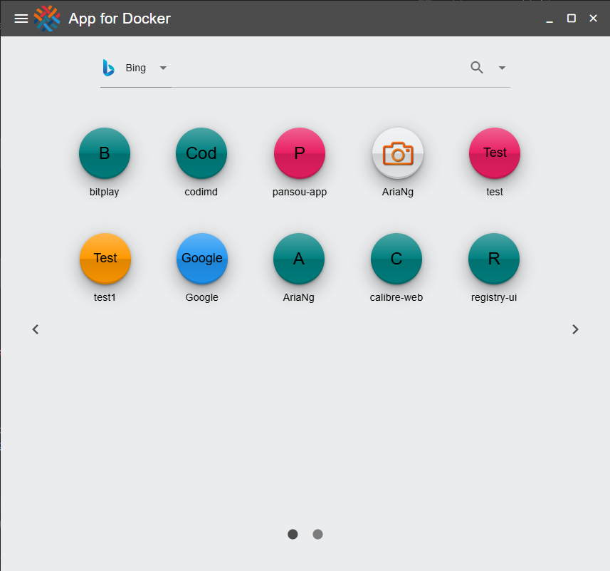
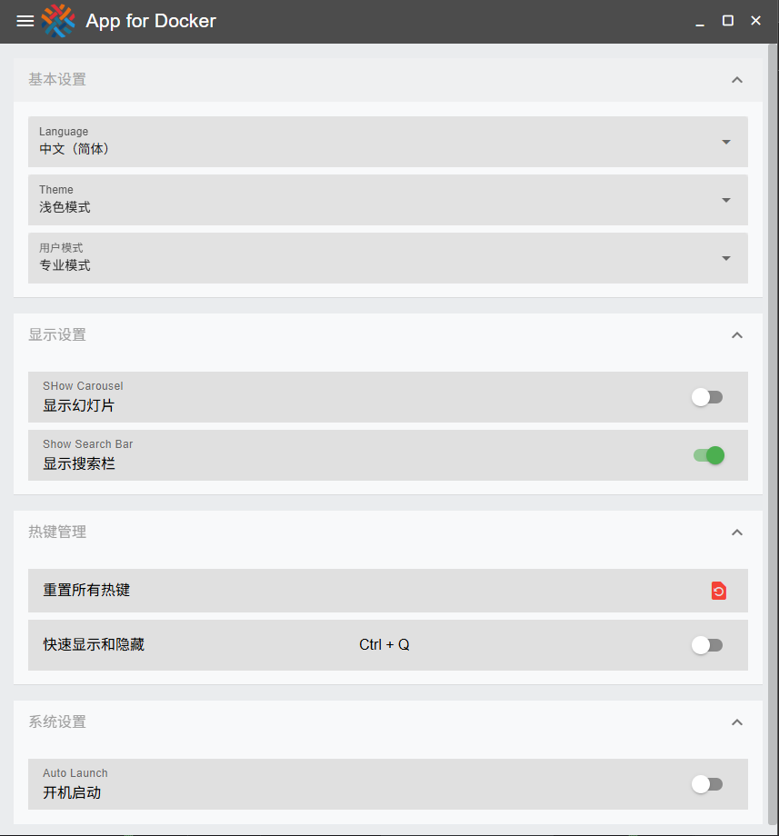
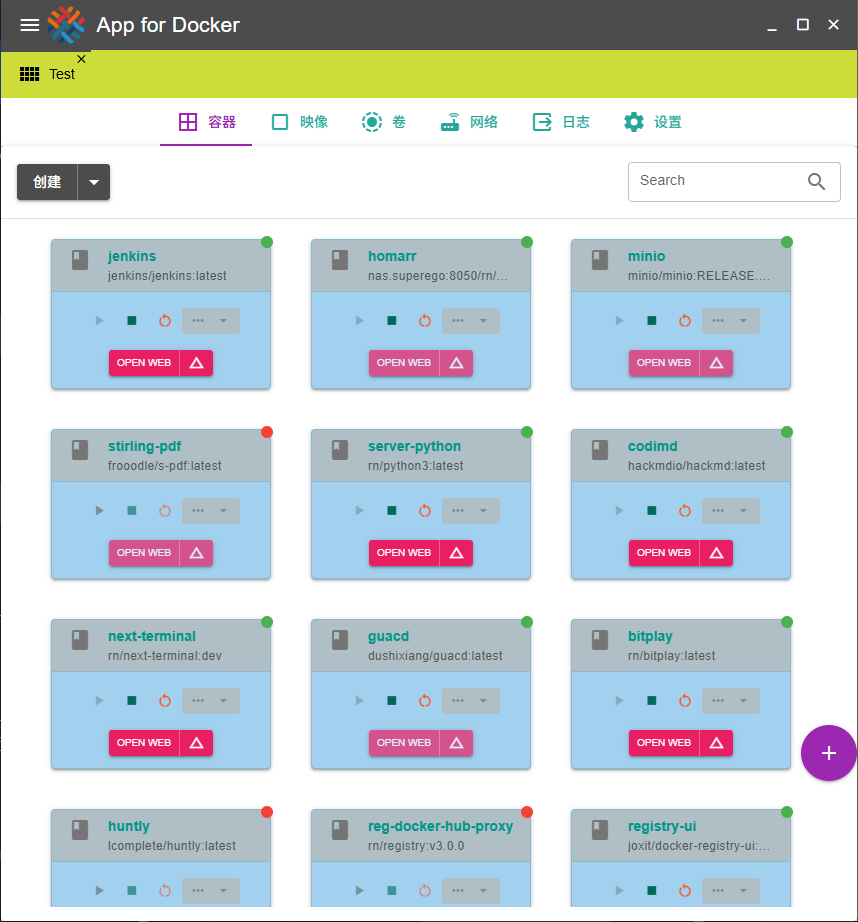
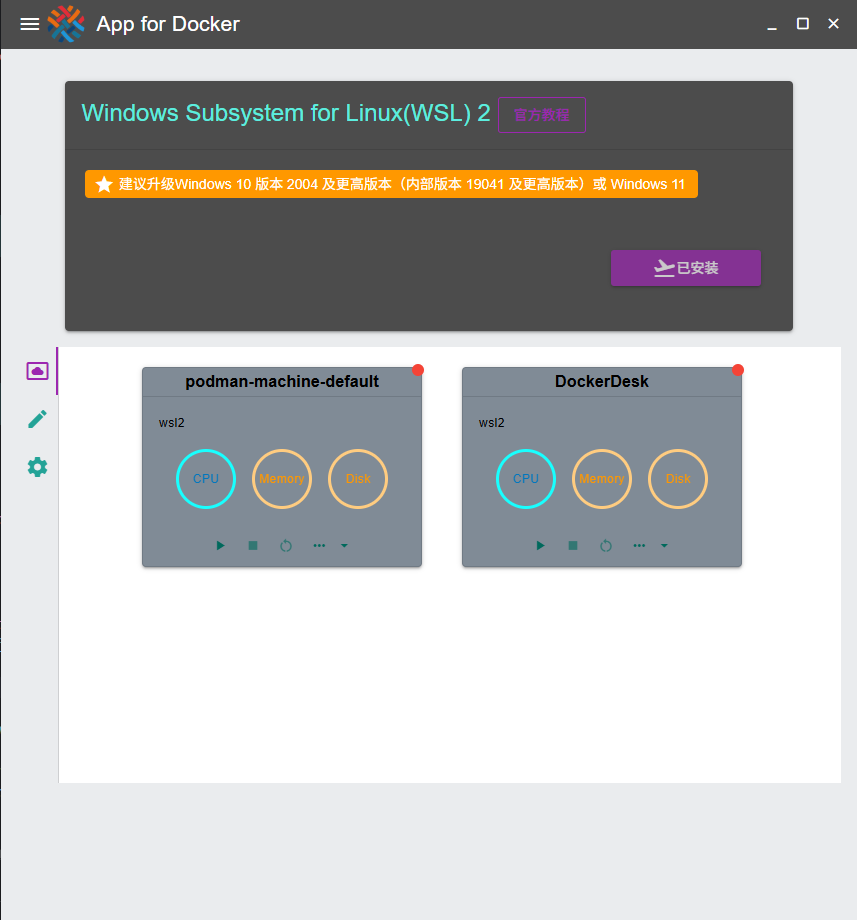

# Docker Desk App (dockerdesk)

Docker Desk App 是一个基于 Quasar 框架构建的桌面应用程序，旨在提供高效的Docker容器的管理和操作功能，包括远程和本地Docker容器。

## Install the dependencies
```bash
yarn
# or
npm install
```

### Start the app in development mode (hot-code reloading, error reporting, etc.)
```bash
quasar dev
```


### Lint the files
```bash
yarn lint
# or
npm run lint
```


### Format the files
```bash
yarn format
# or
npm run format
```


### Build the app for production
```bash
quasar build
```

### Customize the configuration
See [Configuring quasar.config.js](https://v2.quasar.dev/quasar-cli-vite/quasar-config-js).

## Display







